## Bienvenido/a a {.center background-color="#004335"}

::: {.footer}

[EN](index.html) | [FR](index.fr.html) | [ES](index.es.html)

:::

## {background-iframe="https://player.vimeo.com/video/1168715575?badge=0&amp;autopause=0&amp;player_id=0&amp;app_id=58479&amp;autoplay=1" width="100%" height="100%"}

::: {.footer}

[EN](index.html) | [FR](index.fr.html) | [ES](index.es.html)

:::

## nutriverse? {.center background-color="#004225"}

::: {.footer}

[EN](index.html) | [FR](index.fr.html) | [ES](index.es.html)

:::

## nutriverse es {.center}

:::: {.columns}

::: {.column width="33.33%"}

{fig-align="center"}

:::

::: {.column width="33.33%"}

{fig-align="center"}

:::

::: {.column width="33.33%"}

{fig-align="center"}

:::

::::

::: {.footer}

[EN](index.html) | [FR](index.fr.html) | [ES](index.es.html)

:::

::: {.notes}

nutriverse es un proyecto de código abierto, un colectivo y una comunidad de práctica.

:::

## Código abierto {.center .smaller}

:::: {.columns}

::: {.column width="50%"}

{fig-align="center"}

:::

::: {.column width="50%"}

- Desarrollo de paquetes R robustos, probados y eficaces para el análisis de datos nutricionales

- Proporcionar herramientas fiables que respalden todo el ciclo de vida del análisis nutricional, desde la ingesta y limpieza de datos hasta el análisis estadístico, la modelización y la elaboración de informes reproducibles.

:::

::::

::: {.footer}

[EN](index.html) | [FR](index.fr.html) | [ES](index.es.html)

:::

## {.center .smaller}

:::: {.columns}

::: {.column width="50%"}

- Equipo central de personas comprometidas con transformar la forma en que se utilizan, comprenden y comparten los datos nutricionales.

- Creemos que un análisis mejor y más transparente de los datos nutricionales puede combatir las desigualdades, fortalecer la salud pública y apoyar sistemas alimentarios que funcionen para todos.

- A través de la colaboración y las herramientas abiertas, impulsamos prácticas analíticas rigurosas, reproducibles y responsables.

- Compartimos poder y conocimientos, apoyamos el trabajo de los demás y convertimos los datos nutricionales en una fuerza para la justicia social y sanitaria.

:::

::: {.column width="50%"}

{fig-align="center"}

:::

::::

::: {.footer}

[EN](index.html) | [FR](index.fr.html) | [ES](index.es.html)

:::

## Comunidad de práctica{.center .smaller}

:::: {.columns}

::: {.column width="50%"}

{fig-align="center"}

:::

::: {.column width="50%"}

- Reúne a analistas de datos nutricionales, investigadores y profesionales comprometidos con el aprendizaje mutuo.

- Proporciona un espacio compartido para intercambiar métodos, herramientas y experiencias del mundo real en materia de investigación, políticas y práctica.

- A través del aprendizaje entre pares, la resolución colaborativa de problemas y el debate abierto, la comunidad apoya análisis rigurosos y reproducibles.

:::

::::

::: {.footer}

[EN](index.html) | [FR](index.fr.html) | [ES](index.es.html)

:::

## nutriverse hasta ahora... {.center background-color="#004225"}

::: {.footer}

[EN](index.html) | [FR](index.fr.html) | [ES](index.es.html)

:::

## {.center}

{fig-align="center"}

::: {.footer}

[EN](index.html) | [FR](index.fr.html) | [ES](index.es.html)

:::

## Flujo de trabajo de los estudios antropométricos {.center}

{fig-align="center"}

::: {.footer}

[EN](index.html) | [FR](index.fr.html) | [ES](index.es.html)

:::

## Flujo de trabajo de evaluación dietética {.center}

{fig-align="center"}

::: {.footer}

[EN](index.html) | [FR](index.fr.html) | [ES](index.es.html)

:::

## Flujo de trabajo para la evaluación de la cobertura del CMAM{.center}

{fig-align="center"}

::: {.footer}

[EN](index.html) | [FR](index.fr.html) | [ES](index.es.html)

:::

## nutriverse y amigos {.center background-color="#004225"}

::: {.footer}

[EN](index.html) | [FR](index.fr.html) | [ES](index.es.html)

:::

## RapidSurveys {.center}

{fig-align="center"}

::: {.footer}

[EN](index.html) | [FR](index.fr.html) | [ES](index.es.html)

:::

## ¿Qué más y qué sigue? {.center}

- Documentación y publicación multilingüe

- Paquetes para acceder a datos nutricionales

- Paquetes para estandarizar datos nutricionales y garantizar la interoperabilidad

- Aplicaciones de análisis nutricional aptas para la producción

::: {.footer}

[EN](index.html) | [FR](index.fr.html) | [ES](index.es.html)

:::

## Comunidad nutriverse {.center background-color="#004225"}

::: {.footer}

[EN](index.html) | [FR](index.fr.html) | [ES](index.es.html)

:::

## {.center}

### Acérquense a la gente. Vivamos con ellos. Aprendamos de ellos. Amémoslos. Empecemos por lo que saben. Construyamos con lo que tienen. Pero con los mejores líderes, cuando el trabajo esté hecho, la tarea cumplida, la gente dirá: **«Lo hemos hecho nosotros mismos»**.

#### \- Lao Tzu

::: {.footer}

[EN](index.html) | [FR](index.fr.html) | [ES](index.es.html)

:::

## Nuestra comunidad es nuestro mayor activo, la diversidad nuestra mayor fortaleza. {.center}

:::: {.columns}

::: {.column width="20%"}

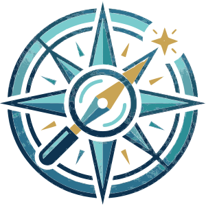{fig-align="center"}

:::

::: {.column width="20%"}

{fig-align="center"}

:::

::: {.column width="20%"}

{fig-align="center"}

:::

::: {.column width="20%"}

{fig-align="center"}

:::

::: {.column width="20%"}

{fig-align="center"}

:::

::::

::: {.footer}

[EN](index.html) | [FR](index.fr.html) | [ES](index.es.html)

:::

## Explore {.center}

:::: {.columns}

::: {.column width="50%"}

{fig-align="center"}

:::

::: {.column width="50%"}

- Explore y descubra paquetes que facilitan la investigación y/o el seguimiento y la evaluación de programas.

- Acceda a datos abiertos sobre salud y nutrición

- Explore y descubra recursos sobre las mejores prácticas para el desarrollo de software

:::

::::

::: {.footer}

[EN](index.html) | [FR](index.fr.html) | [ES](index.es.html)

:::

## Enlace {.center}

:::: {.columns}

::: {.column width="50%"}

- Pertenecer a una comunidad solidaria

- Conozca y trabaje con otros usuarios y desarrolladores de paquetes nutriverse

- Gane visibilidad en la comunidad científica abierta R

:::

::: {.column width="50%"}

{fig-align="center"}

:::

::::

::: {.footer}

[EN](index.html) | [FR](index.fr.html) | [ES](index.es.html)

:::

## Aprenda {.center}

:::: {.columns}

::: {.column width="50%"}

{fig-align="center"}

:::

::: {.column width="50%"}

- Infórmese leyendo y escuchando

- Mejore la reproducibilidad de su investigación y aplique las mejores prácticas en su trabajo

- Mejore sus habilidades en R y desarrollo de software

:::

::::

::: {.footer}

[EN](index.html) | [FR](index.fr.html) | [ES](index.es.html)

:::

## Crear {.center}

:::: {.columns}

::: {.column width="50%"}

- Mejore y promueva la ciencia abierta en su campo

- Influye en el desarrollo de paquetes

- Mejore la documentación y los ejemplos de los paquetes

- Promueva las mejores prácticas para el desarrollo de R

:::

::: {.column width="50%"}

{fig-align="center"}

:::

::::

::: {.footer}

[EN](index.html) | [FR](index.fr.html) | [ES](index.es.html)

:::

## Apoye a {.center}

:::: {.columns}

::: {.column width="50%"}

{fig-align="center"}

:::

::: {.column width="50%"}

- Apoye a Nutriverse o contribuya al código abierto

- Ayude a otros miembros de la comunidad

:::

::::

## Canales de participación{.center background-color="#004225"}

::: {.footer}

[EN](index.html) | [FR](index.fr.html) | [ES](index.es.html)

:::

## Zulip {.center .smaller}

:::: {.columns}

::: {.column width="50%"}

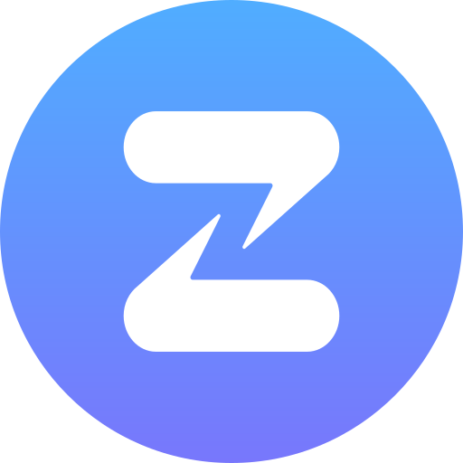{fig-align="center" width="300px"}

:::

::: {.column width="50%"}

- Una aplicación de chat en equipo organizada y diseñada para una comunicación eficaz.

- El foro, de acceso público, puede consultarse en<https://nutriverse.zulipchat.com>

- Para participar en el debate, deberá recibir una invitación para unirse al grupo de chat de la comunidad en Zulip

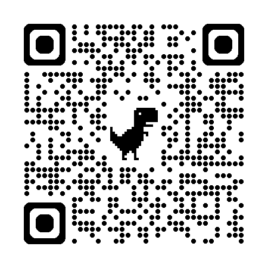{fig-align="center" width="150px"}

:::

::::

::: {.footer}

[EN](index.html) | [FR](index.fr.html) | [ES](index.es.html)

:::

## GitHub {.center .smaller}

:::: {.columns}

::: {.column width="50%"}

{fig-align="center"}

:::

::: {.column width=50%}

- Proveedor de servicios de alojamiento para el desarrollo de software y el control de versiones mediante git

- Incluye funciones como seguimiento de errores, solicitud de funciones, gestión de tareas, integración continua y wikis para cada proyecto

- Reduce las barreras para la colaboración.

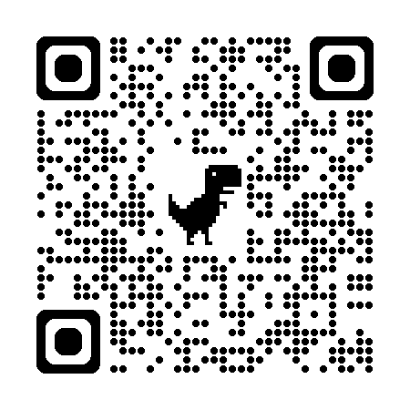{fig-align="center" width="150px"}

:::

::::

::: {.footer}

[EN](index.html) | [FR](index.fr.html) | [ES](index.es.html)

:::

## Redes {.center}

:::: {.columns}

::: {.column width="33.33%"}

[{fig-align="center" height="250px"}](https://mastodon.social/@nutriverse)

:::

::: {.column width="33.33%"}

[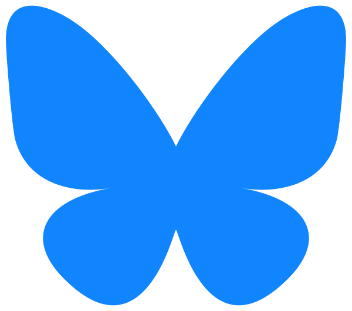{fig-align="center" height="250px"}](https://bsky.app/profile/nutriverse.io)

:::

::: {.column width="33.33%"}

[{fig-align="center" height="250px"}](https://www.linkedin.com/company/nutriverse-community)

:::

::::

:::: {.columns}

::: {.column width="33.33%"}

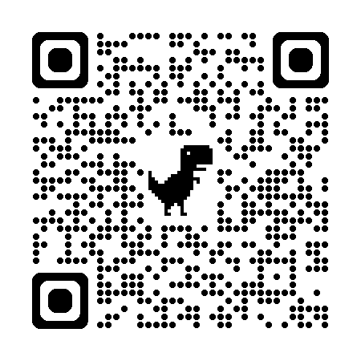{fig-align="center" width="150px"}

:::

::: {.column width="33.33%"}

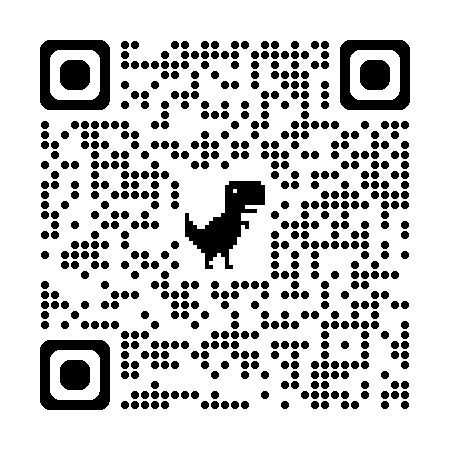{fig-align="center" width="150px"}

:::

::: {.column width="33.33%"}

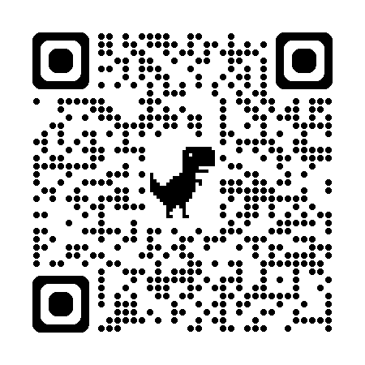{fig-align="center" width="150px"}

:::

::::

::: {.footer}

[EN](index.html) | [FR](index.fr.html) | [ES](index.es.html)

:::

## Sitio{.center .smaller}

:::: {.columns}

::: {.column width="50%"}

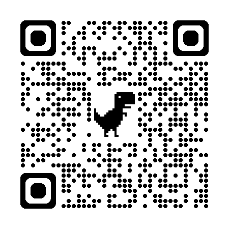{fig-align="center"}

:::

::: {.column width="50%"}

- Manténgase al día con las noticias y anuncios del blog

- Manténgase al día de las últimas novedades sobre los paquetes de Nutriverse, las mejores prácticas en desarrollo de software y consejos sobre ciencia abierta y prácticas de investigación reproducibles a través de nuestras notas tecnológicas

- Entérese de los últimos eventos

:::

::::

::: {.footer}

[EN](index.html) | [FR](index.fr.html) | [ES](index.es.html)

:::

## Llamadas comunitarias{.center .smaller}

:::: {.columns}

::: {.column width="50%"}

{fig-align="center"}

:::

:::{.column width="50%"}

- Llamadas trimestrales a la comunidad para informarse sobre:
  
  - las últimas novedades de Nutriverse;
  - hablar sobre los proyectos actuales y nuevos de Nutriverse o de los miembros de nuestra comunidad;
  - debate sobre las mejores prácticas;
  - escuchar preguntas y respuestas con nuestros desarrolladores de Nutriverse o desarrolladores conocidos de paquetes y herramientas que a los miembros de nuestra comunidad les encanta usar.

- **La primera llamada comunitaria tendrá lugar el miércoles 18 de marzo de 2026 y** contará con la participación del Dr.[Noam Ross](https://www.noamross.net/), director ejecutivo de [rOpenSci](https://ropensci.org/).

:::

::::

::: {.footer}

[EN](index.html) | [FR](index.fr.html) | [ES](index.es.html)

:::

## ¿Cómo se financian todos estos proyectos? {.center .smaller}

:::: {.columns}

::: {.column width="50%"}

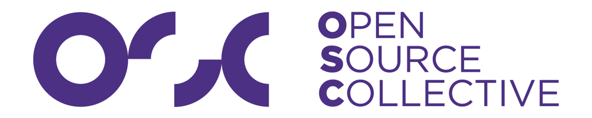{fig-align="center"} 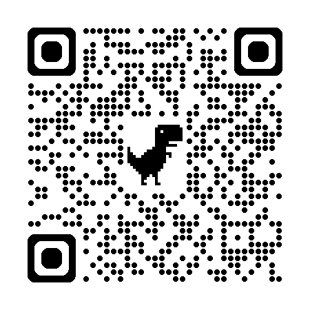

:::

::: {.column width="50%"}

- Todo el software puesto a disposición de la comunidad nutricional desde 2018 sin financiación directa

- Algunos recursos materiales y aportaciones en especie a través de socios
  
  - Universidad de Oxford para recursos GitHub Pro (por un valor de al menos 360 $ al año).
  - Servicios de mensajería y chat para equipos a través de Zulip (por un valor mínimo de 4000 $ al año).

- A principios de 2026, hemos tenido la suerte de contar con el apoyo financiero de[Open Source Collective.](https://oscollective.org/)

:::

::::

::: {.footer}

[EN](index.html) | [FR](index.fr.html) | [ES](index.es.html)

:::

## Financiación (continuación)

- Con el alojamiento fiscal, nos hemos puesto en contacto con fundaciones e instituciones que apoyan los productos de código abierto para financiar los costes de desarrollo y de creación de la comunidad.

## ¿Preguntas? {.center background-color="#004225"}

::: {.footer}

[EN](index.html) | [FR](index.fr.html) | [ES](index.es.html)

:::

## ¡Gracias! {.center background-color="#004225"}

::: {.footer}

[EN](index.html) | [FR](index.fr.html) | [ES](index.es.html)

:::

